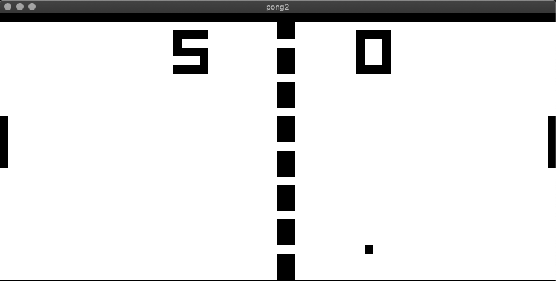
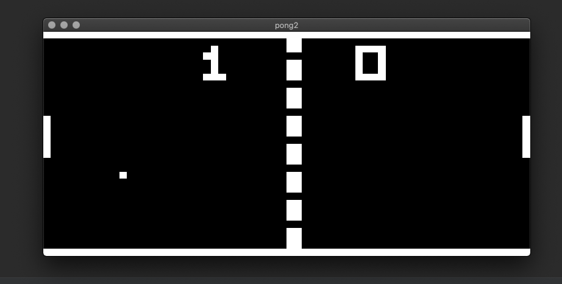

# chipmul8

> CHIP-8 is an interpreted programming language, developed by Joseph Weisbecker.
> It was initially used on the COSMAC VIP and Telmac 1800 8-bit microcomputers in the mid-1970s.
> CHIP-8 programs are run on a CHIP-8 virtual machine.
> It was made to allow video games to be more easily programmed for these computers.
> [CHIP-8](https://en.wikipedia.org/wiki/CHIP-8)

This project aims to replicate the CHIP-8 interpreter using Python, in the hopes that we can play Pong as it ran on the CHIP-8 virtual machine in the 1970's.

## Installation
1. Download / clone the repo
2. Navigate to the chipmul8 directory
3. Run setup.py:

   ```$ python setup.py install``` 

## Execution
1. Run the 'chipmul8' command while providing a path to a chip8 rom:
    
    ```$ chipmul8 /path/to/rom/pong.c8```
    
    
2. The '--invert_colors' switch can also be provided to invert the color palette of the display

    ```$ chipmul8 /path/to/rom/pong.c8 --invert_colors```
    
    
    
## References
The primary reference for this project was [Cowgod's Chip-8 Technical Reference v1.0](http://devernay.free.fr/hacks/chip8/C8TECH10.HTM)
This technical reference is incredibly detailed, the emulator would not have taken shape without it.

For testing [corax89's](https://github.com/corax89/chip8-test-rom) test roms were hugely helpful.
